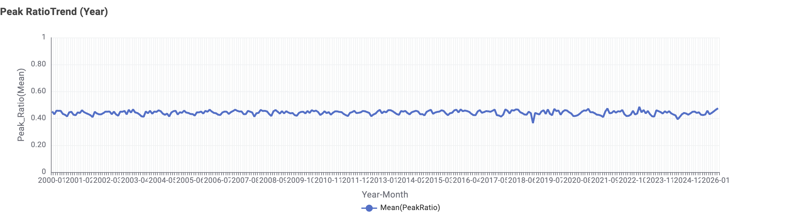
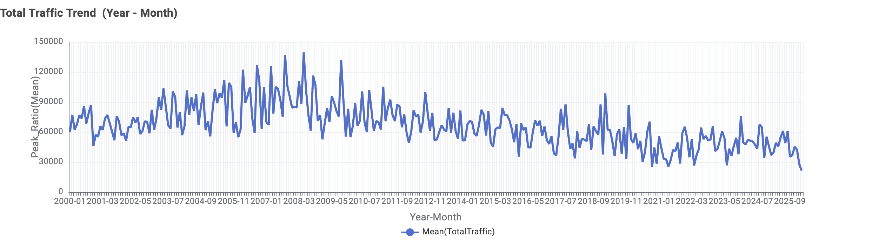
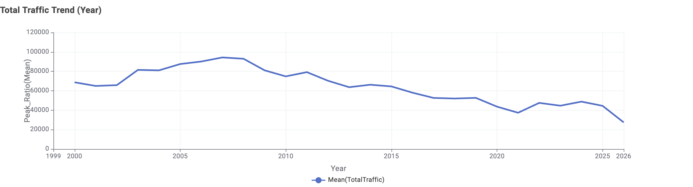
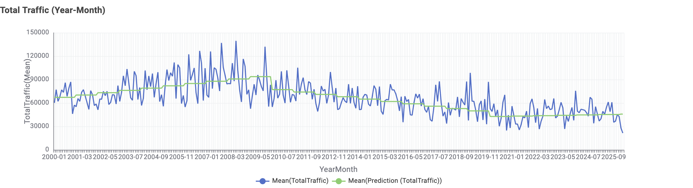
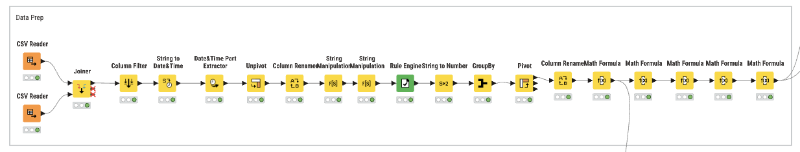

# Traffic Volume Analysis and Prediction: 
# Structure and Predictability in Seattle

Analysis of 26 years of traffic patterns in Seattle to understand temporal structure, evaluate predictability, and examine how problem definition influences model performance using approximately 67,000 observations.

---

## Project Overview

Urban traffic systems generate large volumes of time-based data, but understanding their underlying structure and predicting future behavior remains challenging.

This project analyzes 26 years of traffic data in Seattle to examine both traffic structure and predictability.

The analysis focuses on two key questions:

- How is traffic volume structured over time?  
- What aspects of traffic are actually predictable?  

By combining exploratory analysis and machine learning models, this study aims to identify the limits of prediction and understand how problem definition influences model performance.

---

## Key Takeaways

- Traffic structure remains stable over time, with peak ratios consistently around 0.43–0.46  
- Total traffic volume shows high variability and a long-term decline, peaking around 2007  
- Predicting total traffic using temporal features alone is difficult (R² ≈ 0.2)  
- Lag-based prediction for PM and Midday traffic also shows limited performance (R² ≈ 0.15–0.22)  
- Random Forest and Gradient Boosting produced similar results, indicating feature limitations  
- Prediction performance depends more on problem definition than model selection  
- These findings suggest that traffic behavior consists of predictable structure and unpredictable magnitude  

---

## Business Problem

Traffic congestion has significant economic and operational impacts, affecting commuting efficiency, logistics, and overall urban mobility.

Despite the availability of large-scale traffic data, predicting traffic behavior remains difficult due to:

- High variability in daily traffic volume  
- Influence from external factors such as weather, incidents, and events  
- Differences between stable structural patterns and fluctuating total volume  

Understanding which aspects of traffic are predictable is critical for infrastructure planning, demand forecasting, and traffic management.

This project aims to identify the boundary between predictable and unpredictable components of traffic behavior using temporal data.

---

## Key Visual Results

### 1. Stable Traffic Structure (Peak Ratio)

Peak traffic ratios remain stable across years (~0.43–0.46), indicating that daily traffic structure has not significantly changed over time.

This suggests that while total traffic volume fluctuates, the relative distribution of traffic throughout the day remains consistent.

---

### 2. High Variability in Monthly Traffic

Monthly traffic volume exhibits significant fluctuations, with frequent spikes and drops.

This high variability suggests that traffic volume is strongly influenced by external factors such as weather, events, and incidents, which are not captured in the dataset.

---

### 3. Long-Term Decline in Traffic Volume

Total traffic volume shows a gradual decline over time, with a peak around 2007 and lower levels observed after COVID-19.

This trend suggests structural changes in urban mobility, potentially influenced by economic events and shifts in work patterns.

---

### 4. Prediction vs Actual (Total Traffic)

The model captures the general trend but fails to reproduce short-term fluctuations.

Predictions appear overly smooth compared to actual values, indicating limited sensitivity to variability.

This explains the low model performance (R² ≈ 0.2).

---

### 5. Model Limitation Visualization

The comparison between actual and predicted values highlights that:

- Models can capture overall trends  
- Models struggle to capture volatility  

This reinforces the finding that temporal features alone are insufficient to explain traffic variation.

---

## Modeling Workflow

The following workflow was used to build and evaluate prediction models across all experiments.

### Process Overview

The modeling pipeline consists of the following steps:

- Feature selection using Column Filter  
- Time-based data splitting into training and test sets  
- Model training using multiple algorithms  
- Prediction on unseen test data  
- Performance evaluation using standardized metrics  

---

### 1. Feature Selection

Relevant features were selected from the prepared dataset, including:

- Year  
- Rolling averages (Rolling_lag3)  
- Lag variables (PM_lag1, Midday_lag1, etc.)  

Only historical information was used to ensure realistic prediction conditions.

---

### 2. Train/Test Split

A time-based split was applied:

- Training data: 2000–2018  
- Test data: 2019–2022  

This approach preserves temporal order and prevents data leakage.

---

### 3. Model Training

Multiple models were applied under the same conditions:

- Linear Regression  
- Random Forest  
- Gradient Boosting  

Each model was trained using identical input features to ensure fair comparison.

---

### 4. Prediction

Trained models were used to generate predictions on the test dataset.

Predicted values were compared directly with actual traffic values.

---

### 5. Evaluation

Model performance was evaluated using:

- R² (coefficient of determination)  
- RMSE (Root Mean Square Error)  

These metrics were used consistently across all experiments.

---

### Key Design Principle

A consistent modeling pipeline was applied across all experiments.

This ensured that:

- Differences in performance reflect model behavior, not workflow differences  
- Results are comparable across different prediction tasks  
- The evaluation remains fair and reproducible  

---

## Why KNIME Was Selected

KNIME was selected as the primary tool due to its visual workflow environment and integrated data mining capabilities, which allowed the entire analytical process to be conducted without extensive programming.

A single workflow supports data preparation, transformation, and modeling. This structure made it easier to construct lag features and rolling averages, which were essential for capturing temporal patterns in traffic data.

Model comparison was performed within the same environment, including Linear Regression, Random Forest, and Gradient Boosting. Consistent workflows ensured that differences in performance reflected model behavior rather than implementation differences.

Built-in visualization tools supported interpretation of results and helped identify patterns in both traffic structure and prediction outcomes.

The workflow design also ensured reproducibility, allowing the analysis to be repeated and extended without restructuring the pipeline.

---

## Analytical Approach

This project is structured into three analytical stages:

1. Structural Analysis of Traffic Patterns  
2. Prediction of Total Traffic (Aggregate Behavior)  
3. Prediction of Traffic Components (PM / Midday)  

Each stage is designed to evaluate different aspects of traffic behavior and predictability.

---

## 1. Structural Analysis of Traffic Patterns

### Objective

To understand how traffic volume is structured across time and identify stable versus variable components.

### Key Analyses

- Long-term trend (yearly changes)  
- Monthly variability  
- Peak ratio analysis  

### Findings

- Total traffic volume declined over time  
- Monthly traffic showed high variability  
- Peak ratios remained stable (~0.43–0.46)  
  
### Interpretation

Traffic consists of:

- Stable temporal structure  
- Unstable total magnitude  

This distinction becomes critical in later prediction tasks.

### Final Comment

Total traffic prediction remains challenging even with multiple models.  
This suggests that aggregate traffic behavior is driven by factors beyond temporal patterns, requiring additional external data for meaningful prediction.

---

## 2. Prediction Task 1: Total Traffic

### Objective

To evaluate whether total traffic volume can be predicted using temporal features.

### Features

- Year  
- Rolling_lag3  
- PM_lag1  
- Midday_lag1  

### Results

| Model | R² | RMSE |
|------|----|------|
| Linear Regression | 0.161 | 52,062 |
| Random Forest | 0.216 | 50,327 |
| Gradient Boosting | 0.002 | 56,228 |

### Interpretation

- All models showed low performance  
- Predictions captured general trends but failed to capture variability  

### Final Comment

PM traffic shows slightly better predictability than total traffic, but performance remains limited when relying only on historical features.  
This indicates that even structural components require richer contextual information.

---

## 3. Prediction Task 2: PM Traffic (Lag-based)

### Objective

To evaluate whether PM traffic can be predicted using only historical information.

### Features

- Year  
- Rolling_lag3  
- Midday_lag1  

### Results

| Model | R² | RMSE |
|------|----|------|
| Linear Regression | 0.155 | 15,083 |
| Random Forest | 0.207 | 14,611 |
| Gradient Boosting | 0.207 | 14,611 |

### Interpretation

- Performance remained low across all models  
- Tree-based models did not significantly improve performance  

### Final Comment

Midday traffic follows a similar pattern to PM traffic, with limited improvement across models.  
Consistent results across algorithms suggest that model choice is not the primary constraint.

## Final Project Insight

Across all experiments, model performance remained consistently low despite using multiple algorithms.

This indicates that the primary limitation lies in feature availability rather than model selection.

The results highlight the importance of aligning prediction targets with the underlying structure of the data and incorporating external variables to capture real-world variability.

---

## 4. Prediction Task 3: Midday Traffic

### Objective

To evaluate predictability of midday traffic using lag-based features.

### Features

- Year  
- Rolling_lag3  
- PM_lag1  
- Midday_lag3  

### Results

| Model | R² | RMSE |
|------|----|------|
| Linear Regression | 0.16 | 15,257 |
| Random Forest | 0.22 | 14,702 |
| Gradient Boosting | 0.22 | 14,702 |

### Interpretation

- Performance remained consistently low  
- Model choice had limited impact on results

---

## Key Business Implications

- Traffic demand cannot be accurately predicted using time-based data alone  
- External data (weather, incidents, events) is necessary for improving prediction performance  
- Infrastructure planning should rely on stable structural patterns rather than short-term fluctuations  
- Forecasting models should focus on predictable components rather than aggregate traffic volume  
- Data-driven decision making requires careful selection of prediction targets  

These results suggest that improving model accuracy is not only a technical challenge, but also a problem of defining the right analytical objective.

---

## Business Insights

Traffic behavior in Seattle shows a clear separation between stable structure and unstable magnitude.

The distribution of traffic throughout the day remains consistent over time, indicating that daily traffic patterns are highly structured. While it might be assumed that traffic volume declined due to COVID-19, the data shows that the decrease began earlier, between 2007 and 2010. This suggests that long-term structural changes were already occurring before the pandemic. At the same time, total traffic volume fluctuates significantly, indicating strong influence from external factors such as weather, events, and economic conditions.

Prediction results reinforce this distinction. Models struggled to predict total traffic volume, and even component-level predictions (PM and Midday) showed limited performance when only temporal features were used. Model performance remained consistently low when using lag-based features. Random Forest and Gradient Boosting produced nearly identical results, suggesting that performance is constrained by feature limitations rather than algorithm choice.

These findings indicate that temporal patterns alone are insufficient to fully explain traffic variability. Structural patterns remain stable, while total magnitude is highly variable, which explains the difficulty in predicting total traffic volume.

Overall, traffic systems contain both predictable and unpredictable components. Recognizing this distinction is essential for effective analysis, model design, and decision-making.

---

## Project Strengths

Several aspects of this project contributed to its overall effectiveness.

- A structured data preparation workflow was established, including column selection, missing value handling, and date transformation  
- The use of KNIME enabled an integrated workflow, allowing data preparation and modeling to be performed within a single environment  
- Long-term traffic structure was successfully identified using 26 years of data  
- Multiple algorithms were applied under consistent conditions, enabling systematic comparison of model performance  
- The project clearly distinguished between predictable and unpredictable components of traffic behavior  

---

## Limitations

This project also involved several limitations and challenges.

- Data preparation required significant effort, highlighting its critical role in model performance  
- Random Forest and Gradient Boosting produced nearly identical results in some tasks, indicating limited feature variability  
- Traffic data exhibited substantial noise, even after preprocessing  
- The model relied only on temporal features, without incorporating external variables  

These limitations suggest that the dataset does not fully capture the factors influencing traffic variability.

---

## Next Steps

Further improvements to this project could include the following:

- Incorporating external datasets such as weather conditions, events, economic indicators, and construction data  
- Expanding the feature set to better capture variability in traffic patterns  
- Testing the models on additional traffic datasets to evaluate generalizability  
- Exploring alternative modeling approaches for time-series data  

These steps would help improve both prediction performance and analytical depth.

---

## Author
Yumi Kuwana
M.S. in Data Analytics in Business
Seattle Pacific University
